# Decode Protocol - Agent Flow Architecture

## Complete Agent Interaction Flow

```mermaid
flowchart TD
    Start([User Submits BRD Query]) --> Scout[🔍 Lexical Scout Agent]
    
    Scout -->|Check Cache| CacheCheck{Domain Map<br/>Cached?}
    CacheCheck -->|Yes, < 1hr old| UseCache[Use Cached Domain Map]
    CacheCheck -->|No or Expired| Discover[Sample 500 Vectors<br/>from Qdrant]
    
    Discover --> ExtractNouns[Extract Business Nouns<br/>Order, Invoice, Product]
    ExtractNouns --> ClusterModules[Cluster by Modules<br/>procurement, sales, inventory]
    ClusterModules --> IdentifyPatterns[Identify Domain Patterns<br/>Order-to-Cash, Procure-to-Pay]
    IdentifyPatterns --> GenerateSummary[Generate Domain Summary]
    GenerateSummary --> CacheResult[Cache Domain Map<br/>TTL: 1 hour]
    CacheResult --> UseCache
    
    UseCache --> Architect[🧠 Head Architect]
    
    Architect -->|Receives Domain Map| EnrichContext[Enrich Context with<br/>Domain Vocabulary]
    EnrichContext --> CreatePlan[Create Execution Plan<br/>5 Parallel Tasks]
    
    CreatePlan --> AssignWorkers[Assign Workers by Persona<br/>BACKEND_JAVA, FRONTEND_REACT,<br/>DATABASE_SQL]
    
    AssignWorkers --> Iteration1[📋 ITERATION 1: Initial Scan]
    
    Iteration1 --> Worker1[👷 Worker: BACKEND_JAVA<br/>Focus: procurement-backend<br/>Task: Analyze PurchaseOrder lifecycle]
    Iteration1 --> Worker2[👷 Worker: FRONTEND_REACT<br/>Focus: procurement-webui<br/>Task: Examine UI for order submission]
    Iteration1 --> Worker3[👷 Worker: DATABASE_SQL<br/>Focus: procurement-database<br/>Task: Evaluate schema for procurement]
    Iteration1 --> Worker4[👷 Worker: BACKEND_JAVA<br/>Focus: distribution-module<br/>Task: Investigate integration points]
    Iteration1 --> Worker5[👷 Worker: FRONTEND_REACT<br/>Focus: mobile-webui<br/>Task: Assess mobile UX]
    
    Worker1 --> VectorSearch1[Vector Search<br/>Query: PurchaseOrder Receipt Vendor]
    VectorSearch1 --> FindSymbols1{Symbols<br/>Found in<br/>Postgres?}
    FindSymbols1 -->|Yes| FetchFiles1[Fetch Files from MinIO<br/>PurchaseOrderService.java]
    FindSymbols1 -->|No| NoEvidence1[Report: NO EVIDENCE FOUND]
    
    FetchFiles1 --> AnalyzeCode1[Analyze Code<br/>Extract Business Logic]
    AnalyzeCode1 --> CitEvidence1[Cite Evidence<br/>**Evidence**: `PurchaseOrderService.java` lines 45-67]
    
    Worker2 --> VectorSearch2[Vector Search]
    Worker3 --> VectorSearch3[Vector Search]
    Worker4 --> VectorSearch4[Vector Search]
    Worker5 --> VectorSearch5[Vector Search]
    
    VectorSearch2 --> FindSymbols2{Symbols Found?}
    VectorSearch3 --> FindSymbols3{Symbols Found?}
    VectorSearch4 --> FindSymbols4{Symbols Found?}
    VectorSearch5 --> FindSymbols5{Symbols Found?}
    
    FindSymbols2 -->|Yes| FetchFiles2[Fetch Files]
    FindSymbols3 -->|Yes| FetchFiles3[Fetch Files]
    FindSymbols4 -->|Yes| FetchFiles4[Fetch Files]
    FindSymbols5 -->|Yes| FetchFiles5[Fetch Files]
    
    FindSymbols2 -->|No| NoEvidence2[NO EVIDENCE]
    FindSymbols3 -->|No| NoEvidence3[NO EVIDENCE]
    FindSymbols4 -->|No| NoEvidence4[NO EVIDENCE]
    FindSymbols5 -->|No| NoEvidence5[NO EVIDENCE]
    
    FetchFiles2 --> CitEvidence2[Cite Evidence]
    FetchFiles3 --> CitEvidence3[Cite Evidence]
    FetchFiles4 --> CitEvidence4[Cite Evidence]
    FetchFiles5 --> CitEvidence5[Cite Evidence]
    
    CitEvidence1 --> Validate1{Report Has<br/>Evidence<br/>Citations?}
    CitEvidence2 --> Validate2{Report Has<br/>Evidence?}
    CitEvidence3 --> Validate3{Report Has<br/>Evidence?}
    CitEvidence4 --> Validate4{Report Has<br/>Evidence?}
    CitEvidence5 --> Validate5{Report Has<br/>Evidence?}
    
    NoEvidence1 --> Validate1
    NoEvidence2 --> Validate2
    NoEvidence3 --> Validate3
    NoEvidence4 --> Validate4
    NoEvidence5 --> Validate5
    
    Validate1 -->|Yes| Pass1[Status: COMPLETED]
    Validate1 -->|No| Fail1[Status: FAILED_VALIDATION]
    Validate2 -->|Yes| Pass2[Status: COMPLETED]
    Validate2 -->|No| Fail2[Status: FAILED_VALIDATION]
    Validate3 -->|Yes| Pass3[Status: COMPLETED]
    Validate3 -->|No| Fail3[Status: FAILED_VALIDATION]
    Validate4 -->|Yes| Pass4[Status: COMPLETED]
    Validate4 -->|No| Fail4[Status: FAILED_VALIDATION]
    Validate5 -->|Yes| Pass5[Status: COMPLETED]
    Validate5 -->|No| Fail5[Status: FAILED_VALIDATION]
    
    Pass1 --> CollectReports1[Collect All Worker Reports]
    Pass2 --> CollectReports1
    Pass3 --> CollectReports1
    Pass4 --> CollectReports1
    Pass5 --> CollectReports1
    Fail1 --> CollectReports1
    Fail2 --> CollectReports1
    Fail3 --> CollectReports1
    Fail4 --> CollectReports1
    Fail5 --> CollectReports1
    
    CollectReports1 --> QA1[🔍 QA Agent: Deep Audit<br/>Iteration 1]
    
    QA1 --> CheckEvidence[✅ Check: Evidence Citations Present?]
    CheckEvidence --> CheckSchema[❌ Check: Schema Drift Detection]
    CheckSchema --> CheckBoundary[⚠️ Check: Boundary Contracts Validated?]
    CheckBoundary --> CheckRisks[❌ Check: SRE Risks Identified?]
    CheckRisks --> CheckTypes[✅ Check: Type Mismatches?]
    
    CheckTypes --> QAReport1[Generate QA Report<br/>✅ 2 Passed<br/>❌ 2 Failed<br/>⚠️ 1 Warning]
    
    QAReport1 --> EarlyTermination{All Workers<br/>Found 0 Files?}
    
    EarlyTermination -->|Yes| SkipRefinement[⚠️ Skip Further Iterations<br/>Mark All as COMPLETED_SATISFIED]
    EarlyTermination -->|No| CheckQAIssues{QA Report<br/>Has ❌ or ⚠️?}
    
    SkipRefinement --> FinalSynthesis
    
    CheckQAIssues -->|No Issues| AllSatisfied[All Workers SATISFIED]
    CheckQAIssues -->|Has Issues| Refine[🔁 Architect: Refine Tasks]
    
    AllSatisfied --> FinalSynthesis
    
    Refine --> RefineWorker1{Worker 1<br/>Found Code?}
    RefineWorker1 -->|No| Skip1[Mark SATISFIED<br/>Don't Waste LLM Call]
    RefineWorker1 -->|Yes| GenerateDeeper1[LLM: Generate Deeper Question<br/>Focus on Missing Evidence]
    
    GenerateDeeper1 --> CleanQuestion1[Clean LLM Response<br/>Remove **NEW QUESTION:** headers]
    CleanQuestion1 --> UpdateTask1[Update Worker 1 Task<br/>Status: REFINING]
    
    Skip1 --> Iteration2[📋 ITERATION 2: Deep Dive]
    UpdateTask1 --> Iteration2
    
    Iteration2 --> Worker1_Iter2[👷 Worker 1 Re-executes<br/>with Refined Question]
    Worker1_Iter2 --> VectorSearch1_Iter2[Vector Search<br/>with Cleaned Question]
    VectorSearch1_Iter2 --> FetchFiles1_Iter2[Fetch More Files]
    FetchFiles1_Iter2 --> CitEvidence1_Iter2[Cite Additional Evidence]
    
    CitEvidence1_Iter2 --> CollectReports2[Collect Iteration 2 Reports]
    
    CollectReports2 --> QA2[🔍 QA Agent: Iteration 2 Audit]
    QA2 --> QAReport2[Generate QA Report 2]
    
    QAReport2 --> CheckQAIssues2{QA Report 2<br/>Has ❌ or ⚠️?}
    
    CheckQAIssues2 -->|No| AllSatisfied2[All SATISFIED]
    CheckQAIssues2 -->|Yes, < 4 iterations| Refine2[Refine Again]
    CheckQAIssues2 -->|Yes, = 4 iterations| MaxIterations[Max Iterations Reached]
    
    Refine2 --> Iteration3[📋 ITERATION 3: Cross-Validation]
    Iteration3 --> QA3[QA Agent 3]
    QA3 --> CheckQAIssues3{Issues?}
    CheckQAIssues3 -->|Yes| Iteration4[📋 ITERATION 4: Final Pass]
    CheckQAIssues3 -->|No| AllSatisfied3[All SATISFIED]
    
    Iteration4 --> QA4[QA Agent 4]
    QA4 --> MaxIterations
    
    AllSatisfied2 --> FinalSynthesis
    AllSatisfied3 --> FinalSynthesis
    MaxIterations --> FinalSynthesis
    
    FinalSynthesis[📝 Business Analyst: Synthesize BRD]
    
    FinalSynthesis --> DetectBRD{Query Contains<br/>'BRD' or<br/>'Business Requirements'?}
    
    DetectBRD -->|Yes| BRDMode[Switch Persona:<br/>Expert Business Analyst]
    DetectBRD -->|No| SREMode[Switch Persona:<br/>SRE Architect]
    
    BRDMode --> ExtractFacts[Extract Business Facts<br/>from Code Evidence ONLY]
    ExtractFacts --> MapStakeholders[Map Stakeholders from Modules<br/>procurement → Procurement Team]
    MapStakeholders --> TranslateRisks[Translate Technical Risks<br/>to Business Impact]
    TranslateRisks --> DeriveMetrics[Derive Success Metrics<br/>from Code Instrumentation]
    DeriveMetrics --> BuildAppendix[Build Code Evidence Appendix<br/>List All Cited Files]
    
    SREMode --> TechnicalBlueprint[Generate SRE Technical Blueprint]
    
    BuildAppendix --> GenerateBRD[Generate BRD Sections:<br/>1. Executive Summary<br/>2. Project Goals<br/>3. Scope & Boundary<br/>4. Stakeholders<br/>5. Business Risks<br/>6. Success Metrics<br/>7. Analysis Process<br/>8. Code Evidence Appendix]
    
    TechnicalBlueprint --> GenerateSRE[Generate SRE Blueprint]
    
    GenerateBRD --> FinalOutput[📄 Final BRD Document]
    GenerateSRE --> FinalOutput
    
    FinalOutput --> End([Return to User])
    
    style Scout fill:#e1f5ff
    style Architect fill:#fff4e1
    style Worker1 fill:#e8f5e9
    style Worker2 fill:#e8f5e9
    style Worker3 fill:#e8f5e9
    style Worker4 fill:#e8f5e9
    style Worker5 fill:#e8f5e9
    style QA1 fill:#fff3e0
    style QA2 fill:#fff3e0
    style QA3 fill:#fff3e0
    style QA4 fill:#fff3e0
    style FinalSynthesis fill:#f3e5f5
    style BRDMode fill:#e8eaf6
    style SREMode fill:#e8eaf6
```



## Key Decision Points & Checkpoints

### 🔍 Checkpoint 1: Scout Cache Check
**Location**: `LexicalScoutAgent.discoverDomain()`
**Decision**: Use cached domain map or re-discover?
**Criteria**: Cache age < 1 hour
**Impact**: Saves 2-3 seconds if cached

### 🧠 Checkpoint 2: Architect Planning
**Location**: `AgentOrchestrator.createExecutionPlan()`
**Decision**: How many workers? What focus areas?
**Input**: Domain map + user query
**Output**: 3-5 parallel worker tasks

### 👷 Checkpoint 3: Worker Evidence Validation
**Location**: `AgentOrchestrator.executeTaskWithType()`
**Decision**: Does report have evidence citations?
**Criteria**: Must contain `**Evidence**: \`filename\`` pattern
**Outcome**: 
- ✅ Pass → Status: COMPLETED
- ❌ Fail → Status: FAILED_VALIDATION

### 🔍 Checkpoint 4: QA Deep Audit
**Location**: `AgentOrchestrator.executeSwarm()` (QA phase)
**Decision**: Are there critical issues?
**Checks**:
- ✅ Evidence citations present?
- ❌ Schema drift detected?
- ⚠️ Boundary contracts validated?
- ❌ SRE risks identified?
- ✅ Type mismatches?

**Outcome**:
- All ✅ → Skip refinement
- Any ❌ or ⚠️ → Trigger refinement

### 🔁 Checkpoint 5: Early Termination
**Location**: `AgentOrchestrator.refineTasksBasedOnQA()`
**Decision**: Should we continue iterating?
**Criteria**: Did ANY worker find code?
**Outcome**:
- All workers found 0 files → **STOP** (save 75% LLM calls)
- Some workers found code → Continue with those workers only

### 🔁 Checkpoint 6: Refinement Loop
**Location**: `AgentOrchestrator.refineTasksBasedOnQA()`
**Decision**: Which workers need deeper questions?
**Criteria**: 
- Worker found no code → Skip (mark SATISFIED)
- Worker found code but QA flagged issues → Refine
**Max Iterations**: 4

### 📝 Checkpoint 7: Synthesis Mode Selection
**Location**: `AgentOrchestrator.synthesizeResults()`
**Decision**: Generate BRD or SRE Blueprint?
**Criteria**: Query contains "BRD" or "Business Requirements"?
**Outcome**:
- BRD Mode → Business Analyst persona, non-technical language
- SRE Mode → Technical architect persona, infrastructure focus

## Agent Communication Flow

### Worker → QA Agent
```
Worker Report:
  ### Finding: Order Processing Flow
  **Evidence**: `OrderService.java` (lines 45-67)
  ```java
  public Order createOrder(OrderRequest req) {
      Payment p = paymentGateway.processPayment(req);
  }
  ```
  **Analysis**: Blocking payment call creates risk

QA Agent Response:
  ❌ SRE Risk: Synchronous payment gateway call
  ⚠️ Boundary Contract: No timeout configured
  ✅ Evidence: Properly cited
```

### QA Agent → Architect
```
QA Report (Iteration 1):
  ❌ Type Mismatches: None detected (No relevant code found)
  ⚠️ SRE Risks: None identified (No relevant code found)
  ❌ Boundary Contracts: Could not be verified (No code)

Architect Decision:
  → All workers found 0 files
  → EARLY TERMINATION
  → Skip iterations 2, 3, 4
```

### Architect → Workers (Refinement)
```
Architect Refinement Instruction:
  Worker: BACKEND_JAVA
  Previous Report: "No relevant code found"
  QA Critique: "No evidence citations"
  
  Refined Question (Cleaned):
  "What specific methods handle PurchaseOrder creation 
   and what database tables are involved?"
  
  (Original LLM response had "**NEW, DEEPER QUESTION:**" header - removed)
```

### Workers → Business Analyst
```
Aggregated Worker Reports:
  - BACKEND_JAVA: Found 3 files (OrderService, PaymentGateway, OrderRepository)
  - FRONTEND_REACT: Found 2 files (OrderForm.tsx, PaymentModal.tsx)
  - DATABASE_SQL: Found 0 files
  
Business Analyst Synthesis:
  "Based on analysis of 5 files across 2 modules..."
  
  Evidence Appendix:
  - OrderService.java: Core order processing with payment integration
  - PaymentGateway.java: External payment API (blocking calls detected)
```

## Performance Metrics

| Phase | Time | LLM Calls | Cacheable |
|-------|------|-----------|-----------|
| Scout Discovery | 2-3s | 0 | ✅ Yes (1hr TTL) |
| Architect Planning | 3-5s | 1 | ❌ No |
| Worker Execution (5 workers) | 10-15s | 5 | ❌ No |
| QA Audit | 5-7s | 1 | ❌ No |
| Refinement (if needed) | 3-5s | 1 | ❌ No |
| Worker Re-execution | 10-15s | 3-5 (only workers with code) | ❌ No |
| Final Synthesis | 8-10s | 1 | ❌ No |
| **Total (with refinement)** | **45-60s** | **14-19** | - |
| **Total (early termination)** | **20-30s** | **7** | - |

## Optimization Impact

### Before Optimizations
- Every query: 4 iterations × 5 workers = 20 LLM calls
- Time: 2-3 minutes
- Cost: 20 × token_cost

### After Optimizations
- Scout cached: Saves 2-3s on subsequent queries
- Early termination: Saves 75% LLM calls when no code found
- Smart refinement: Only refines workers that found code
- Clean questions: Better vector search results

**Result**: 30-70% reduction in time and cost
